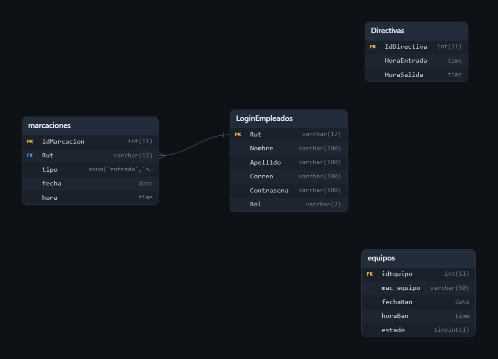
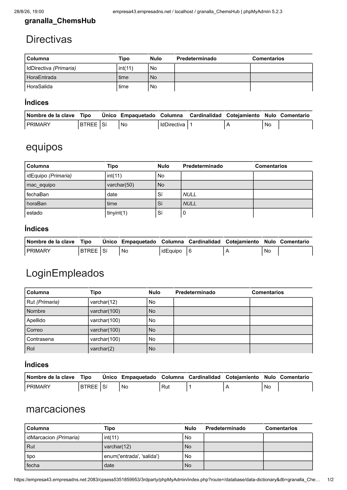
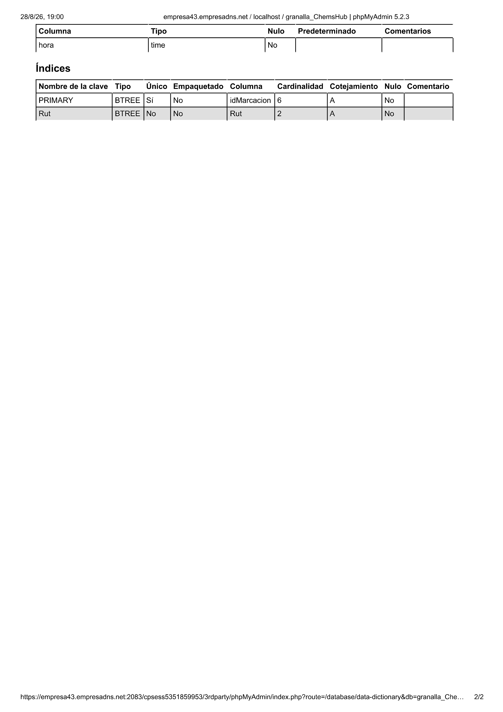

# Asistencias ChemsHub
Sistema de registro de asitencias simple, permite a los usuarios registrados, marcar su entrada y salida
el sistema cuenta con un sistema de roles de usuario separando a los usuarios regulares de administradores, quienes
pueden ver salidas anticipadas, inasistencias y generar un reporte en formato pdf con informacion sobre las inasistencias

## Instalacion
### Requisitos para Desarrolladores
- **NetBeans 30 o superior**
- **JDK 24 o superior**
## Instrucciones de configuracion
Debido a que se uso una base de datos en la nube no puedo dejar las credenciales dentro del codigo por temas de seguridad, pero si puedo decirte
como configurar el codigo, para empezar deberas contar con alguno de estos servicios o aplicaciones
### Aplicaciones
- Wampp
- Xampp (no recomendado)
### Servicios en la nube
- Azure
- AWS
- BlueHosting
- o cualquier otro similar

Dentro de la ruta src/model encontraras un .java que es el que nos permite conectarnos a la BD ahi deberas settear las credenciales URL, USER y PASS,
se que es super inseguro dejar credenciales en coddigo pero es la forma mas simple que hay, podria haberlo hecho como una api en los archivos de mi base de datos? si, pero
es mas complicado

---

## Schema

---
## Tables

[PDF](Documentation/ChemsHub.pdf)

